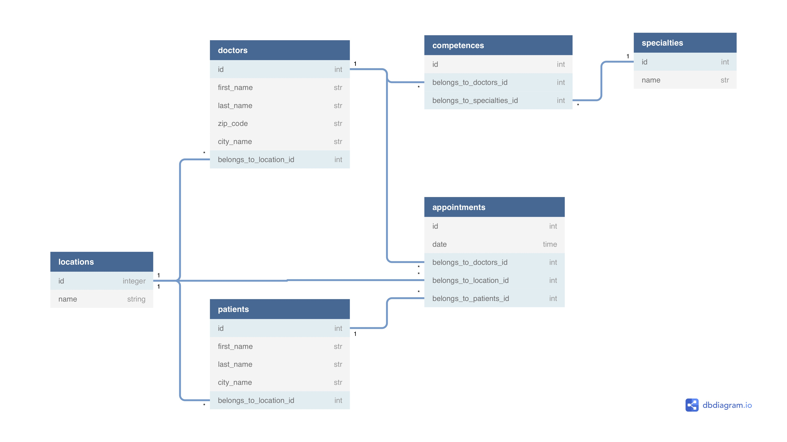

# README

Creation des models: 

	Doctor, Patient, Appointment, Location, Competence & Specialty

Avec les relations:

	Un appointment ne peut avoir qu'un seul doctor, mais un doctor peut avoir plusieurs appointment.
	Un appointment ne peut avoir qu'un seul patient, mais un patient peut avoir plusieurs appointment.
	Un doctor peut avoir plusieurs patient, au travers des appointments, et vice versa.
	Chaque docteur, patient, et rendez-vous est lié à une city. Une city peut avoir plusieurs docteurs, patients, et rendez-vous.
	Un docteur aurait plusieurs specialty et une specialty pourrait concerner plusieurs doctor.

Creation d'un seeds.rb

